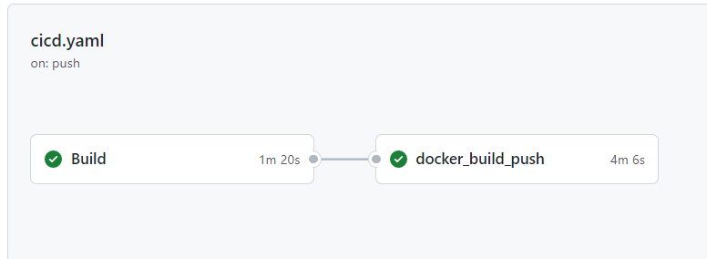
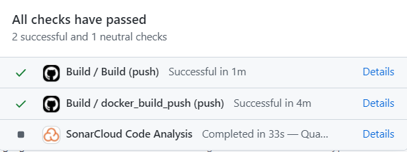
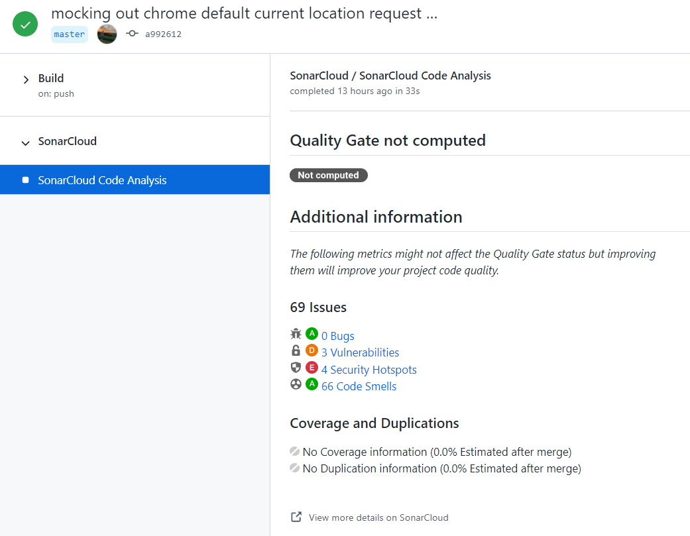
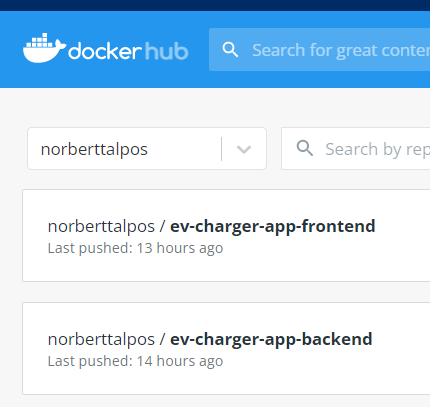

# CI beüzemelése

A CI pipeline implementálásához a Github Actions keretrendszerre esett a választásunk.
A mi esetünkben a pipeline-nak két fő feladata van:
- Statikus ellenőrzés SonarCloud segítségével
- Docker image-ek buildelése

#### Egy példa futása a ci pipeline-nak

### Statikus ellenőrzés SonarCloud segítségével
A SonarCloud job elkészítése magától értetődő volt a kapcsolódó gyakorlat alapján.

### Docker image-ek buildelése
A Docker image-ek buildelését a docker_build_push job végzi, ami csak a master-re push-oláskor hajtódik végre.
A job első körben kiegészíti a biztonságkritikus részeit a szoftvernek (pl: smtp jelszó beillesztése environment
változóként az application.properties-be) github secretek segítségével,
majd lebuildeli a Docker image-eket a Dockerfile-ok alapján, ezután pusholja ezeket
az image-eket a kijelölt Dockerhub repository-ba, hogy fel lehessen őket használni.

#### A lebuildelt image-ek sikeresen fel lettek pusholva a kijelölt Dockerhub repóba

