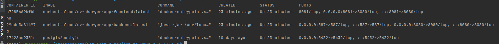

### Virág József Ádám -- U7KC0P

During the project, I first created the *Dockerfile*s for each component. Separate Dockerfiles have been created for the frontend and the backend to allow the project to be run in a *container*.

After writing the _Dockerfile_, the next task was to write the _docker-compose_ file. This allows the frontend, the backend and the database to run at the same time, as they are built upon each other. I defined _networks_ between _services_ to connect the components. With this step, I helped the **deployment** stage of the project.

If we start the containers, we see the following picture: the database is running on port 5432, the backend is running on port 8080, and the frontend is running on port 8081:

In the second part of the project I tested the non-functional requirements.

For the webapp, I tried out the Chrome supported Lighthouse as a **performance** testing tool:

Lighthouse is an open-source, automated tool for improving the quality of web pages. You can run it against any web page, public or requiring authentication. It has audits for performance, accessibility, progressive web apps, SEO and more.

You can run Lighthouse in Chrome DevTools, from the command line, or as a Node module. You give Lighthouse a URL to audit, it runs a series of audits against the page, and then it generates a report on how well the page did. From there, use the failing audits as indicators on how to improve the page. Each audit has a reference doc explaining why the audit is important, as well as how to fix it.

Our result: 

Finally, I conducted security tests. I used the [Nessus](https://www.tenable.com/products/nessus) tool for it.

It is the world number-one **security** vulnerability scanner used by organisations, pen testers, security consultants. We used the Essential, free version of the software. It searched for network vulnerabilities around our project. The only problem was that I couldn't constrain the scope of the examination to the sole horizon of the project, so the tool examined my whole computer on _localhost_, thus finding vulnerabilities not correlated to this assignment.

The output of the program was this (containing even non-important parts): 

The test found the open ports on the computer:

It found the PostgreSQL server:

And it also found the Docker service:

