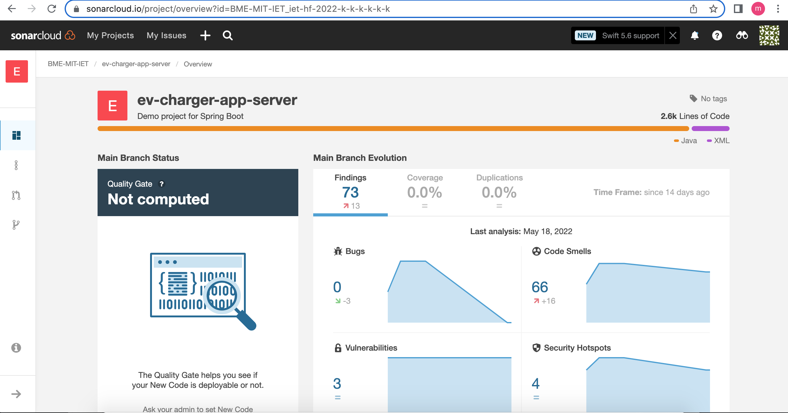
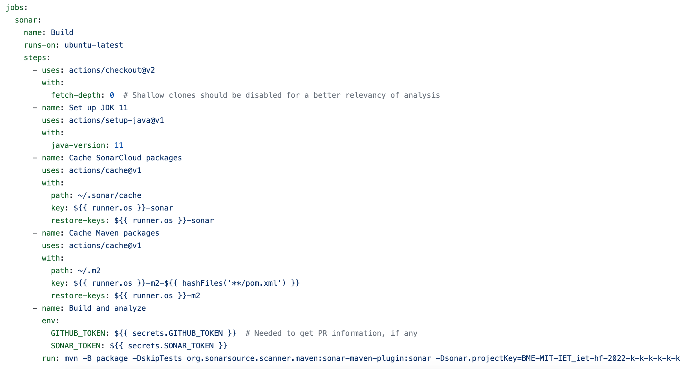
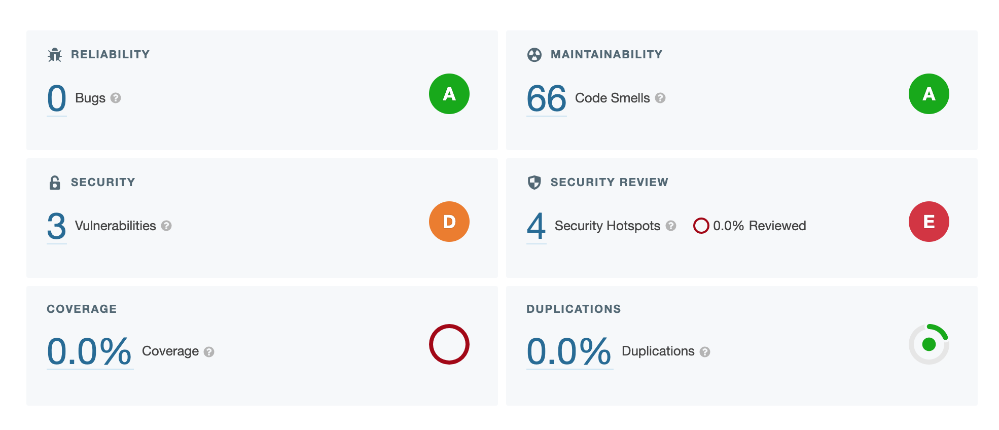
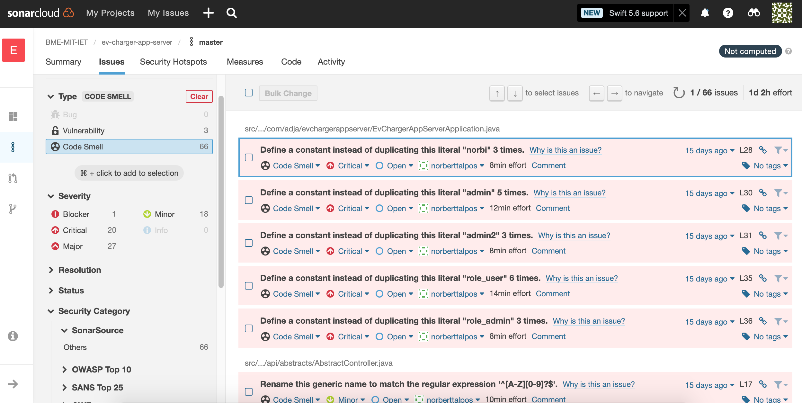

# SonarCloud

SonarCloud is a **cloud-based code analysis service** designed to detect code quality issues in 25 different programming languages, continuously ensuring the maintainability, reliability and security of your code.

SonarCloud uses state-of-the-art techniques in static code analysis to find problems, and potential problems, in the code that you and your team write.

Static analysis is called static because it does not rely on actually running the code.

## SonarCloud with GitHub

SonarCloud also integrates smoothly with GitHub (and many other tools).

You need to have a SonarCloud organisation to connect with GitHub, then you can easily import your GitHub project to SonarCloud.

Your SonarCloud project will correspond one-to-one with your Github project, which resides in its own Git repository.

_SonarCloud overview_

A **GitHub Action** is responsible for executing Sonar's analysis on your codebase. You can specify different triggering events, branches and much more to meet your project's requirements. In our case, we ran the Action on any pull requests to master branch. You can see our implementation below.

_GitHub Action for SonarCloud Analysis_

Finishing the GitHub Action you can collect countless details about your project under numerous options on your SonarCloud site. For example you can observe your GitHub projects branch by branch.

_SonarCloud Master Branch_

Sonar automatically opens issues for you regarding to your project's bugs, vulnerabilities or code smells.Furthermore, it guides you to the exact line of code, which raised the issue.

